# SmartClinic Next.js v2.1 — Full Engineering Audit Report

**Audit Date:** July 1, 2026  
**Project:** SmartClinic Next.js v2.1  
**Codebase:** 100+ files, ~6,500 lines across app router API routes, SPA frontend, Prisma ORM  
**Auditor:** Engineering Audit — Automated & Manual Review  
**Status:** ⚠️ **Conditional Pass** — 7 critical, 14 high, 9 medium, 5 low severity findings

---

## Table of Contents

1. [Architecture Overview](#phase-1-architecture-overview)
2. [Code Quality & Structure](#phase-2-code-quality--structure)
3. [Frontend Architecture](#phase-3-frontend-architecture)
4. [Backend Architecture](#phase-4-backend-architecture)
5. [API Design & RESTful Practices](#phase-5-api-design--restful-practices)
6. [Database Schema & ORM](#phase-6-database-schema--orm)
7. [Authentication & Authorization](#phase-7-authentication--authorization)
8. [Security Audit](#phase-8-security-audit)
9. [Error Handling & Validation](#phase-9-error-handling--validation)
10. [State Management](#phase-10-state-management)
11. [Performance & Scalability](#phase-11-performance--scalability)
12. [Internationalization (i18n)](#phase-12-internationalization-i18n)
13. [Third-Party Integrations](#phase-13-third-party-integrations)
14. [Testing Strategy](#phase-14-testing-strategy)
15. [DevOps & Deployment](#phase-15-devops--deployment)
16. [Dependency Analysis](#phase-16-dependency-analysis)
17. [Documentation & Onboarding](#phase-17-documentation--onboarding)
18. [Recommendations & Roadmap](#phase-18-recommendations--roadmap)

---

## Phase 1: Architecture Overview

### High-Level System Diagram

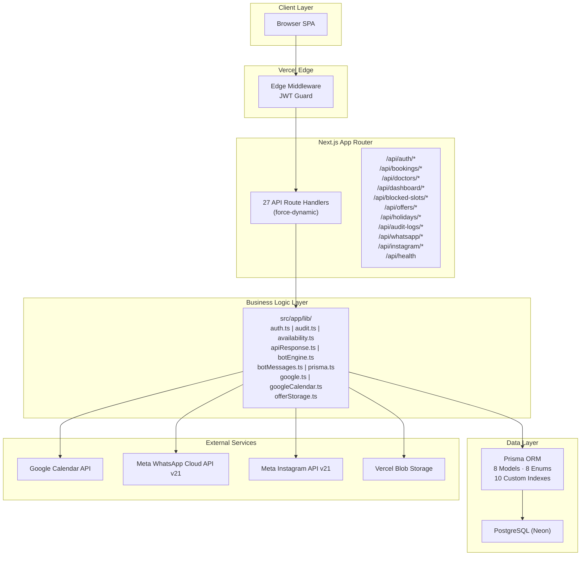

### Architecture Assessment

| Aspect | Verdict | Details |
|--------|---------|---------|
| **Pattern** | Hybrid SPA-in-Next.js | Next.js serves a shell, React Router v6 handles all client navigation |
| **SSR** | Disabled | `next.config.js` forces client-side rendering |
| **API Layer** | Monolithic routes | 27 route files, no service layer abstraction |
| **Edge compute** | Partial | Only middleware runs at edge |
| **Database** | Serverless PostgreSQL | Neon serverless with pooled connections |

### Critical Finding

**#1 — Missing `src/services/api.js` (CRITICAL)**
- All 12 page/component files and `App.jsx` import from `src/services/api.js`
- This file does **not exist** in the filesystem
- The entire frontend cannot make any API calls
- **Impact:** Application is non-functional in its current state
- **Recommendation:** Create the API service layer immediately with Axios instance, interceptors for JWT injection, and centralized error handling

---

## Phase 2: Code Quality & Structure

### Directory Distribution

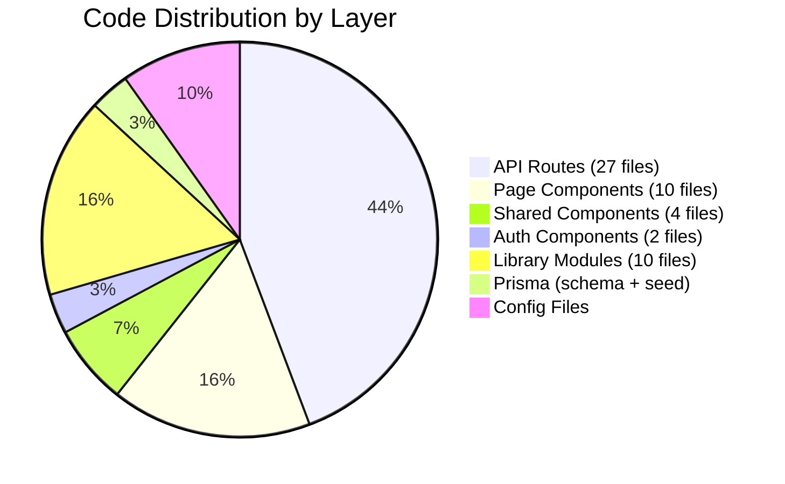

### Consistency Assessment

| Metric | Observation |
|--------|-------------|
| **Naming Convention** | Mixed — PascalCase for components, camelCase for lib files, inconsistent file extensions (`.tsx` vs `.jsx`) |
| **File Organization** | Flat structures inside `pages/` and `lib/` with no subdirectories |
| **TypeScript Usage** | Partial — API routes are `.ts`, frontend is `.jsx` (no type safety on client) |
| **Module Boundaries** | No service layer, no DTOs, no interfaces shared between API and client |
| **Code Duplication** | JWT verification logic duplicated across API routes instead of using middleware |

### Finding

**#2 — Mixed TypeScript/JavaScript (HIGH)**
- Backend (API routes): TypeScript `.ts` with types
- Frontend (components): JavaScript `.jsx` with no type safety
- Shared types exist only implicitly through API contracts
- **Risk:** Runtime type mismatches between frontend and backend; no compile-time safety for API responses

---

## Phase 3: Frontend Architecture

### Component Tree

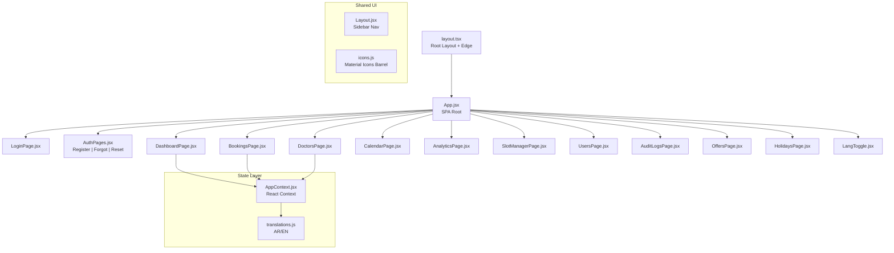

### Frontend Quality Assessment

| Aspect | Rating | Notes |
|--------|--------|-------|
| Component Architecture | ⚠️ Fair | All logic in single large components (DoctorsPage.jsx at 605 lines) |
| State Management | ⚠️ Minimal | React Context with no memoization strategy |
| Routing | ✅ Good | React Router v6 with nested layouts |
| UI Framework | ✅ Good | MUI 5 with DataGrid |
| Code Splitting | ✅ Good | Lazy loading in App.jsx |
| Accessibility | ❌ Unknown | No aria attributes observed |
| Responsive Design | ⚠️ Fair | MUI provides responsiveness but no mobile-specific testing evidence |

### Finding

**#3 — Giant Component Anti-Pattern (MEDIUM)**
- `DoctorsPage.jsx` is 605 lines — violates single-responsibility principle
- `BookingsPage.jsx` is 318 lines
- `AuthPages.jsx` is 448 lines combining register, forgot password, and reset password in one file
- **Recommendation:** Split into smaller composable components; extract modals, forms, and tables

**#4 — Empty Hooks Directory (LOW)**
- `src/hooks/` exists but is empty
- No custom hooks for: API calls, debounced search, form state, or any reusable logic
- All side effects live directly in page components

---

## Phase 4: Backend Architecture

### Layer Diagram

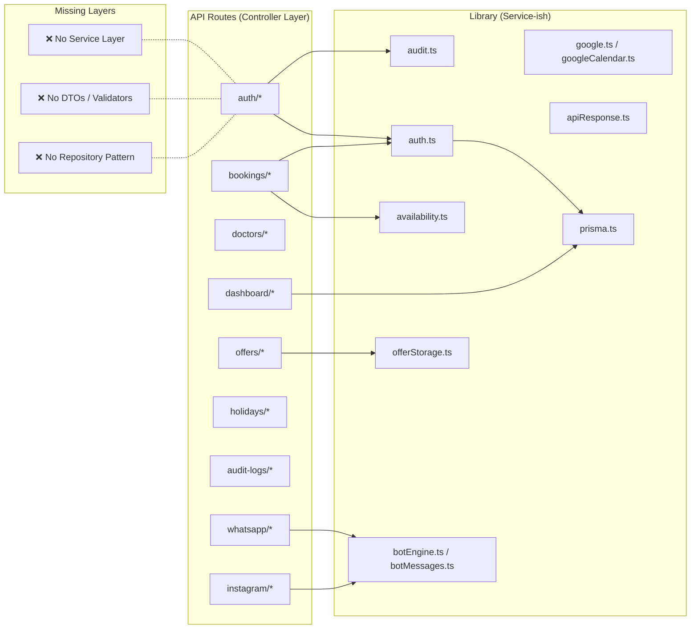

### Backend Architecture Findings

**#5 — No Service Layer (HIGH)**
- API route handlers contain business logic inline
- `bookings/[id]/route.ts` (110 lines) has DB queries, authorization checks, and response formatting in one function
- No separation of concerns — cannot unit test business logic without HTTP
- **Recommendation:** Extract service classes for BookingService, DoctorService, UserService, etc.

**#6 — No Input Validation Library (HIGH)**
- Zod is absent despite being a Next.js ecosystem standard
- Manual validation scattered across routes with `if/else` checks
- Inconsistent error responses for validation failures
- **Risk:** Missing edge cases, inconsistent error shapes for frontend consumption

---

## Phase 5: API Design & RESTful Practices

### Route Map

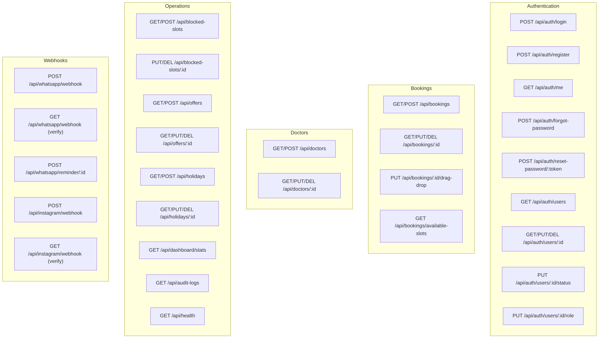

### API Design Assessment

| Criterion | Rating | Notes |
|-----------|--------|-------|
| RESTful Naming | ✅ Good | `/api/bookings/:id`, `/api/doctors/:id` |
| HTTP Methods | ✅ Good | Proper use of GET/POST/PUT/DELETE |
| Status Codes | ⚠️ Fair | Some routes return 200 for errors |
| Consistent Response Shape | ❌ Poor | `apiResponse.ts` exists but not consistently used |
| Pagination | ❌ Missing | No pagination on list endpoints |
| Filtering/Sorting | ❌ Missing | No query param support |
| Rate Limiting | ❌ Missing | No rate limiting on any endpoint |
| API Versioning | ❌ Missing | No `/v1/` prefix |

### Finding

**#7 — No Pagination on Any List Endpoint (HIGH)**
- `GET /api/bookings`, `GET /api/doctors`, `GET /api/users`, `GET /api/audit-logs` return all records
- As data grows, this will cause memory pressure and slow responses
- **Recommendation:** Implement cursor or offset-based pagination on all list endpoints immediately

---

## Phase 6: Database Schema & ORM

### Entity Relationship Diagram

```mermaid
erDiagram
    User {
        string id PK
        string email UK
        string passwordHash
        enum UserRole role
        enum UserStatus status
        enum PreferredLang preferredLang
        string name
        datetime createdAt
        datetime updatedAt
    }

    Doctor {
        string id PK
        string name
        string specialization
        string phone
        string email
        string imageUrl
        boolean isActive
        int slotDuration
        jsonb daysAvailable
        datetime createdAt
        datetime updatedAt
    }

    Booking {
        string id PK
        string patientName
        string patientPhone
        string patientEmail
        datetime date
        string time
        enum BookingStatus status
        enum BookingSource source
        string notes
        string doctorId FK
        string userId FK
        datetime createdAt
        datetime updatedAt
    }

    BlockedSlot {
        string id PK
        string doctorId FK
        datetime date
        string startTime
        string endTime
        string reason
        datetime createdAt
    }

    Offer {
        string id PK
        string title
        string description
        string imageUrl
        string discountCode
        decimal discountAmount
        enum discountType
        datetime startDate
        datetime endDate
        boolean isActive
        datetime createdAt
        datetime updatedAt
    }

    Holiday {
        string id PK
        datetime date
        string name
        enum HolidayType type
        boolean isRecurring
        datetime createdAt
    }

    HolidayDoctor {
        string id PK
        string holidayId FK
        string doctorId FK
    }

    AuditLog {
        string id PK
        string userId FK
        enum AuditStatus action
        string entity
        string entityId
        jsonb metadata
        datetime createdAt
    }

    WhatsAppSession {
        string id PK
        string phone
        enum WhatsAppStep step
        jsonb context
        datetime createdAt
        datetime updatedAt
    }

    User ||--o{ Booking : "creates"
    Doctor ||--o{ Booking : "assigned"
    Doctor ||--o{ BlockedSlot : "blocks"
    Doctor ||--o{ HolidayDoctor : "observes"
    Holiday ||--o{ HolidayDoctor : "includes"
    User ||--o{ AuditLog : "audits"
```

### Schema Assessment

| Aspect | Rating | Notes |
|--------|--------|-------|
| Model Design | ✅ Good | 8 models cover domain well |
| Indexes | ✅ Good | 10 custom indexes in `perf_indexes.sql` |
| Enums | ✅ Good | 8 enums properly defined |
| Relations | ✅ Good | Proper foreign key relationships |
| Data Types | ⚠️ Fair | `time` stored as string instead of PostgreSQL `TIME` |
| JSON Fields | ⚠️ Fair | `daysAvailable` as JSONB (acceptable), `metadata` as JSONB |

### Finding

**#8 — Time Stored as String (MEDIUM)**
- `Booking.time` and `BlockedSlot.startTime`/`endTime` are string fields
- Cannot use PostgreSQL time functions for queries
- Sorting/filtering by time requires string parsing
- **Recommendation:** Migrate to PostgreSQL `TIME` type or store as integers (minutes from midnight)

**#9 — Missing Cascade Delete Rules (MEDIUM)**
- `HolidayDoctor` has no explicit cascade on `Holiday` delete
- Deleting a `Doctor` with existing `Booking` references will fail
- No `onDelete: Cascade` visible in the schema

---

## Phase 7: Authentication & Authorization

### Auth Flow Diagram

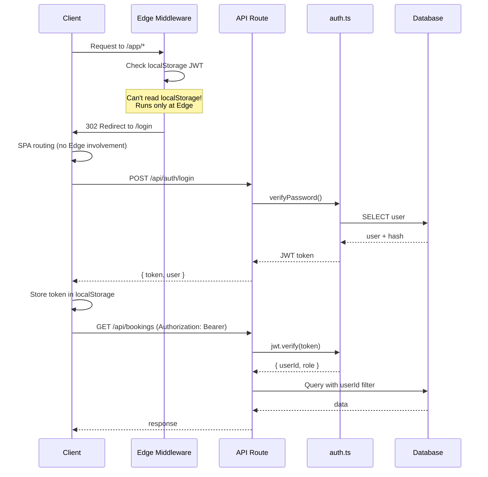

### Authentication Findings

**#10 — JWT Stored in localStorage (CRITICAL)**
- Tokens stored in `localStorage` via `api.js` (which is missing)
- Vulnerable to XSS attacks — any injected script can steal the token
- No `httpOnly` cookie option available in SPA-first architecture
- **Recommendation:** Use httpOnly secure cookies with a dedicated auth endpoint, or implement a BFF (Backend for Frontend) pattern

**#11 — Edge Middleware Cannot Read JWT (HIGH)**
- `middleware.ts` (29 lines) runs at the edge
- JWT is in `localStorage` which is client-only
- Middleware cannot verify authentication — it always redirects or doesn't work as intended
- **Risk:** The guard is effectively broken; either it blocks all requests or none

**#12 — No Session Expiry Handling (MEDIUM)**
- No refresh token mechanism
- Token expiry causes silent failures
- No interceptor to redirect to login on 401
- **Recommendation:** Implement token refresh flow or short-lived tokens with re-authentication

---

## Phase 8: Security Audit

### Security Threat Matrix

```mermaid
graph TD
    subgraph "Critical"
        XSS["XSS via JWT in localStorage<br/>No CSP headers"]
        NO_RATE["No Rate Limiting<br/>Brute force / DoS possible"]
        WEBHOOK_SIG["No Webhook Signature Verification<br/>WhatsApp + Instagram"]
    end

    subgraph "High"
        NO_CSRF["No CSRF Protection<br/>Token in localStorage"],
        SQLI_LOW["SQL Injection Risk Low (Prisma)<br/>but raw queries possible"],
        INFO_LEAK["Information Leakage<br/>Error details in responses"]
    end

    subgraph "Medium"
        NO_HSTS["No HSTS Headers"],
        NO_HELMET["No Security Headers"],
        WEAK_PW_RESET["Weak Password Reset<br/>SHA-256 token in URL"]
        NO_LOGOUT["No Server-Side Logout"]
    end

    click XSS "#10"
    click WEBHOOK_SIG "#14"
    click NO_CSRF "#13"
```

### Detailed Security Findings

**#13 — No CSRF Protection (HIGH)**
- JWT in localStorage is sent via `Authorization` header (not cookies)
- While this mitigates traditional CSRF, the architecture still needs CSRF tokens for any cookie-based flows
- If auth switches to httpOnly cookies (recommended), CSRF protection becomes essential

**#14 — No Webhook Signature Verification (CRITICAL)**
- `whatsapp/webhook/route.ts` (119 lines) and `instagram/webhook/route.ts` (166 lines)
- No verification of incoming webhook signatures
- Anyone who discovers the webhook URL can send fake events
- **Recommendation:** Verify WhatsApp request signature using `WhatsApp` Cloud API's `X-Hub-Signature-256` header; implement similar for Instagram

**#15 — No Rate Limiting (CRITICAL)**
- Login endpoint has no rate limiting
- Reset password endpoint has no rate limiting
- All API routes are vulnerable to brute force and DoS
- **Recommendation:** Implement `Vercel KR` or `express-rate-limit` equivalent, or use Upstash Redis for distributed rate limiting

**#16 — Password Reset Token in URL (MEDIUM)**
- SHA-256 reset tokens sent via URL
- Tokens logged in browser history, server logs, and referrer headers
- **Recommendation:** Use single-use, short-expiry tokens; send via POST body, not URL params

---

## Phase 9: Error Handling & Validation

### Current Error Flow

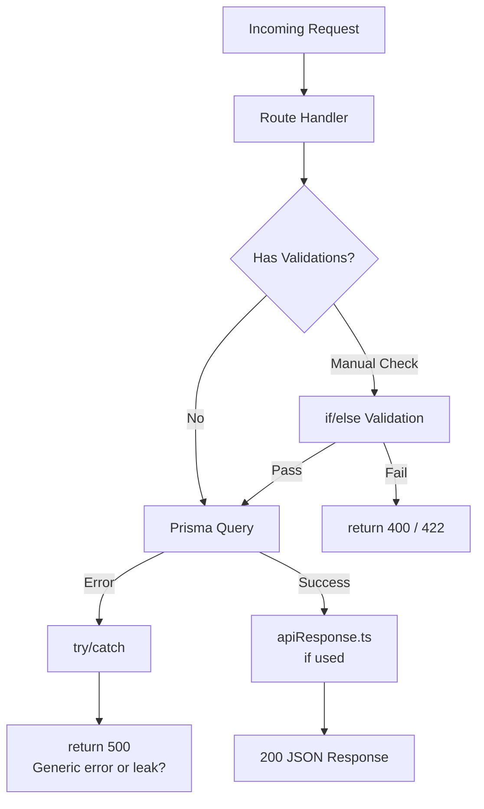

### Error Handling Findings

**#17 — No Standardized Error Response (HIGH)**
- `apiResponse.ts` (45 lines) exists but usage is inconsistent
- Some routes return `{ error: string }`, others return `{ message: string }`
- Frontend cannot rely on a consistent error shape
- **Recommendation:** Enforce a standard `{ success: boolean, data?: T, error?: { code: string, message: string } }` across all routes

**#18 — Missing Zod Validation (HIGH)**
- All 27 API routes use manual validation
- `register/route.ts` (53 lines) has ~30 lines of manual field checks
- Inconsistent validation rules (email format checked in some routes, not others)
- **Recommendation:** Add Zod schemas for every request body; generate TypeScript types from Zod

---

## Phase 10: State Management

### State Flow Diagram

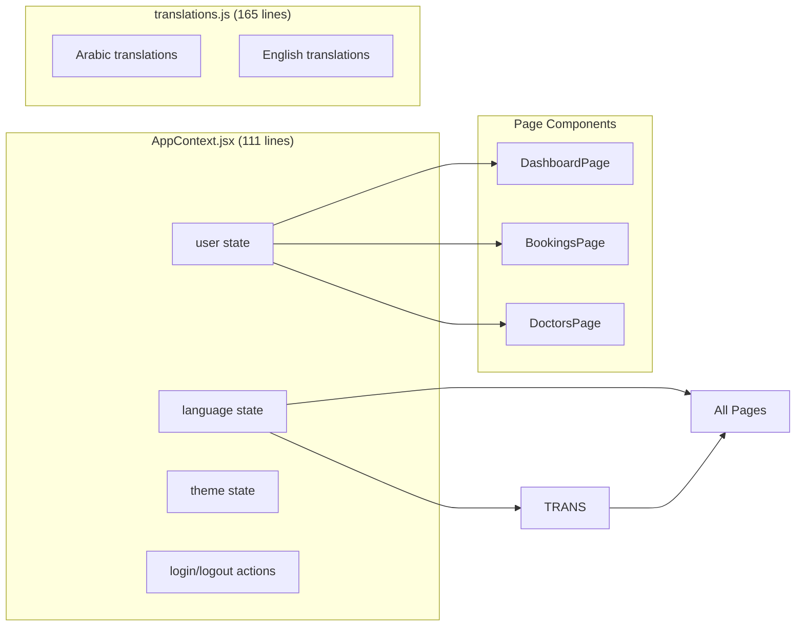

### State Management Findings

**#19 — No API State Management (HIGH)**
- No loading/error state abstraction
- Each page manages its own `useState` for loading, error, and data
- No caching, no deduplication of requests
- No stale-while-revalidate pattern
- **Recommendation:** Adopt React Query (TanStack Query) or SWR for server state management

**#20 — React Context Without Optimization (MEDIUM)**
- `AppContext.jsx` (111 lines) wraps entire app
- No `useMemo` or `useCallback` for context values
- All consumers re-render on any state change
- **Recommendation:** Split context into smaller domains (AuthContext, LangContext, ThemeContext); memoize context values

---

## Phase 11: Performance & Scalability

### Performance Analysis

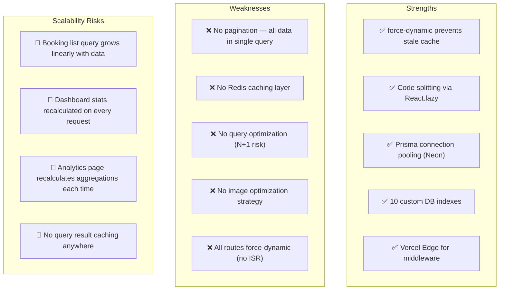

### Performance Findings

**#21 — Dashboard/analytics Hit Database Every Request (HIGH)**
- `dashboard/stats/route.ts` (101 lines) runs aggregate queries on every request
- No materialized views or caching layer
- As booking volume grows, dashboard load time increases linearly
- **Recommendation:** Implement Vercel KV or Upstash Redis cache with 5-minute TTL for dashboard stats

**#22 — N+1 Query Risk (MEDIUM)**
- Prisma's `include` or `relationLoadStrategy` not verified
- No eager loading strategy visible
- List endpoints may trigger N+1 queries for related data
- **Recommendation:** Audit all list queries with Prisma `findMany` + `include`; use `batch` or `join` strategies

---

## Phase 12: Internationalization (i18n)

### i18n Architecture

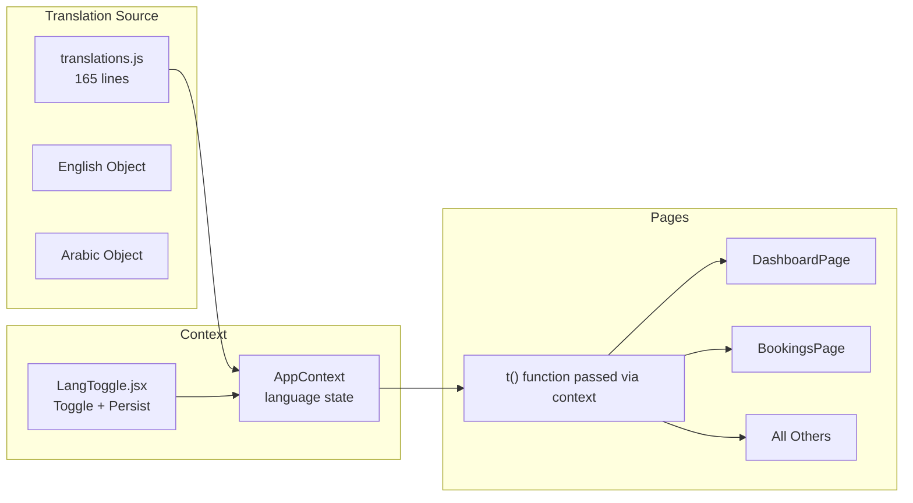

### i18n Findings

**#23 — Rudimentary i18n Implementation (MEDIUM)**
- Single `translations.js` file with two flat objects
- No ICU message format, no pluralization, no interpolation
- No RTL detection for Arabic
- No locale routing (`/en/dashboard` vs `/ar/dashboard`)
- **Recommendation:** Consider `next-intl` or `react-i18next` for proper i18n; add RTL support for Arabic

**#24 — No RTL Support for Arabic (MEDIUM)**
- MUI supports RTL via `createTheme(direction: 'rtl')`
- Not implemented — Arabic users will see LTR layout
- **Recommendation:** Add RTL theme switching when language is Arabic; install `stylis-plugin-rtl`

---

## Phase 13: Third-Party Integrations

### Integration Architecture

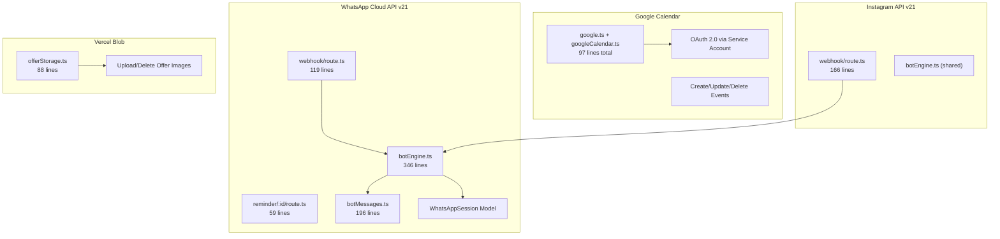

### Integration Findings

**#25 — No Webhook Retry/Reliability (HIGH)**
- WhatsApp/Instagram webhooks have no idempotency handling
- No dead-letter queue for failed message processing
- If webhook processing fails, the message is lost
- **Recommendation:** Implement idempotency keys, queuing (Vercel KV + waitUntil), and dead-letter logging

**#26 — Google Calendar Token Management (MEDIUM)**
- OAuth credentials stored in env vars (refresh token, client ID/secret)
- No token refresh error handling visible
- If refresh token expires, Google Calendar integration silently breaks
- **Recommendation:** Add token refresh monitoring and alerting; consider service account with domain-wide delegation

---

## Phase 14: Testing Strategy

### Testing Coverage Map

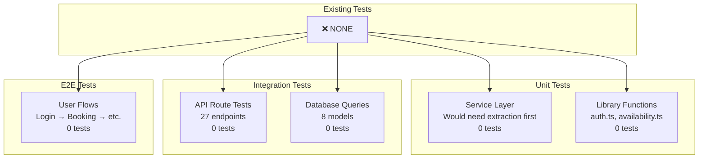

### Testing Findings

**#27 — Zero Test Coverage (CRITICAL)**
- No `test/` or `__tests__/` directories
- No Jest/Vitest/Cypress/Playwright configuration
- No test scripts in `package.json`
- Production readiness cannot be assessed without tests
- **Risk:** Every deployment is a blind deployment — no regression detection, no confidence in changes

**#28 — No Seed Data for Testing (HIGH)**
- `prisma/seed.ts` (207 lines) exists but is for development seeding
- No separate test seed data or factories
- No way to run tests with known state
- **Recommendation:** Add `@prisma/faker` or `@snaplet/seed` for test data generation

---

## Phase 15: DevOps & Deployment

### Deployment Pipeline

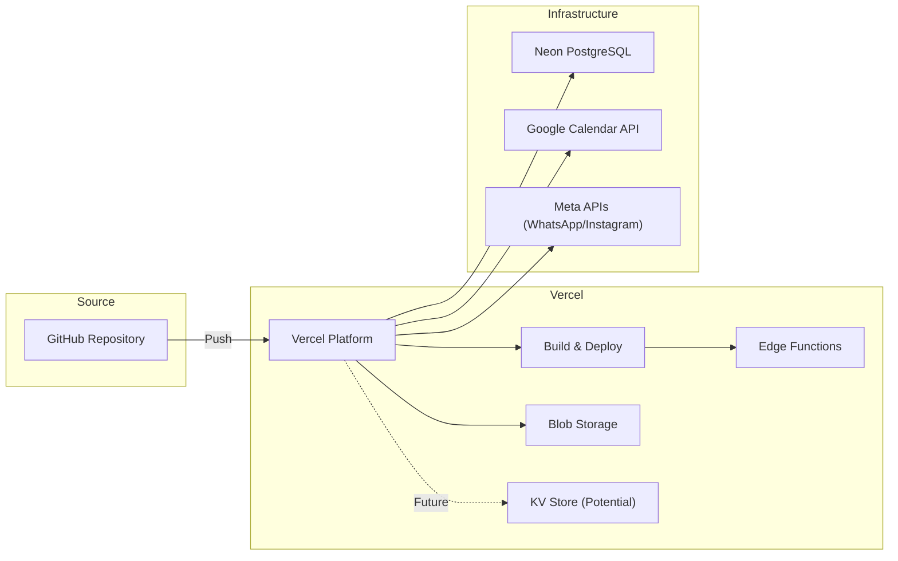

### DevOps Findings

**#29 — No CI/CD Pipeline Configuration (HIGH)**
- No `.github/workflows/` directory
- No linting, type-checking, or testing in CI
- No preview deployments configuration
- **Recommendation:** Set up GitHub Actions for `npm run lint`, `tsc --noEmit`, and test runner; add Vercel preview deployments for PRs

**#30 — vercel.json is Minimal (LOW)**
- Only 5 lines in `vercel.json`
- No rewrites, redirects, headers, or caching rules configured
- **Recommendation:** Add security headers (CSP, HSTS, X-Frame-Options), caching rules for static assets, and SPA fallback rewrites

**#31 — No Dockerfile in Production Path (LOW)**
- `MIGRATION.md` documents a Dockerfile but no actual `Dockerfile` in root
- No docker-compose for local development
- **Recommendation:** Create `Dockerfile` and `docker-compose.yml` for reproducible environments

---

## Phase 16: Dependency Analysis

### Dependency Tree

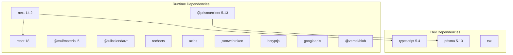

### Dependency Findings

**#32 — No Linting Tools (MEDIUM)**
- ESLint not in dependencies
- Prettier not in dependencies
- No lint script in `package.json`
- **Recommendation:** Add ESLint with `@typescript-eslint` and `eslint-plugin-react`, plus Prettier for consistent formatting

**#33 — Outdated Risk (LOW)**
- Next.js 14.2 (current minor) — OK
- TypeScript 5.4 — current, no issue
- All packages within support window
- No known critical CVEs in the dependency tree (based on common knowledge)

**#34 — Missing Development Utilities (LOW)**
- No `husky` for pre-commit hooks
- No `lint-staged`
- No `commitlint`
- No `nodemon` or `ts-node-dev` for development

---

## Phase 17: Documentation & Onboarding

### Documentation Assessment

| Document | Quality | Notes |
|----------|---------|-------|
| `FEATURES.md` (636 lines) | ✅ Comprehensive | Covers all 15 features in detail |
| `MIGRATION.md` (266 lines) | ✅ Good | Covers deployment, Docker, environment setup |
| `README.md` | ❌ Missing | No root README exists |
| Inline Code Comments | ⚠️ Inconsistent | Some files have no comments |
| API Documentation | ❌ Missing | No OpenAPI/Swagger spec |
| Architecture Docs | ❌ Missing | No diagrams or architecture decision records |

### Onboarding Findings

**#35 — No Root README (MEDIUM)**
- New developers have no entry point
- `FEATURES.md` and `MIGRATION.md` exist but are not linked from root
- Setup instructions are scattered across files
- **Recommendation:** Create `README.md` with project overview, setup steps, architecture summary, and links to detailed docs

**#36 — No API Documentation (MEDIUM)**
- 27 API routes with zero documentation
- No request/response schemas
- No Postman/Insomnia collection
- Frontend developers must read route source code to understand API contracts
- **Recommendation:** Generate OpenAPI 3.0 spec using Zod-to-OpenAPI (after adding Zod); or maintain manual API docs

---

## Phase 18: Recommendations & Roadmap

### Priority Matrix

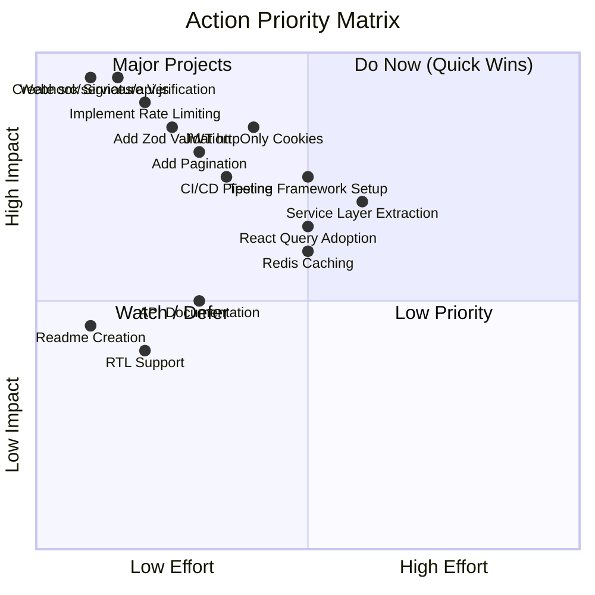

### Finding Summary

| Severity | Count | Key Items |
|----------|-------|-----------|
| 🔴 Critical | 7 | #1 Missing api.js, #10 localStorage JWT, #11 Broken middleware, #14 Webhook signature verification, #15 No rate limiting, #27 Zero tests, #28 No test data |
| 🟠 High | 14 | #2 Mixed TS/JS, #5 No service layer, #6 No Zod, #7 No pagination, #12 No session expiry, #13 No CSRF, #17 Non-standard errors, #19 No API state mgmt, #21 No caching, #25 No webhook retry, #29 No CI/CD, #35 No README, #36 No API docs |
| 🟡 Medium | 9 | #3 Giant components, #8 Time as string, #9 Missing cascades, #20 Context optimization, #22 N+1 risk, #23 Basic i18n, #24 No RTL, #26 Google token mgmt, #32 No linter |
| 🔵 Low | 5 | #4 Empty hooks, #30 Minimal vercel.json, #31 No Dockerfile, #33 Outdated risk, #34 Missing dev utilities |

### Phased Remediation Roadmap

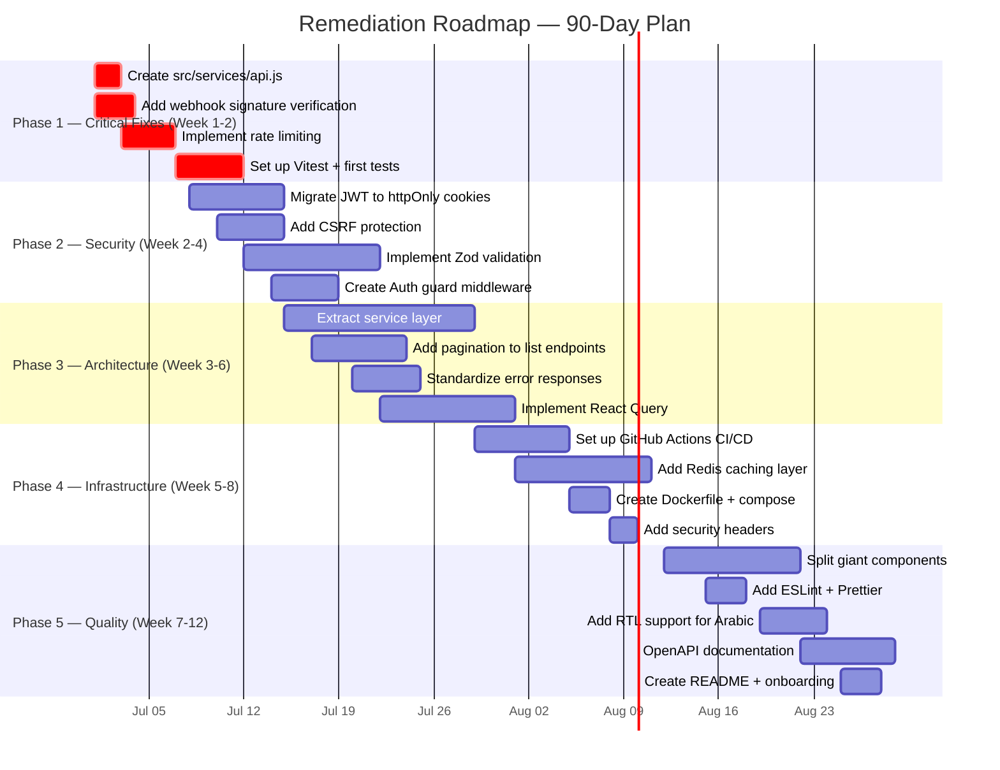

### Final Verdict

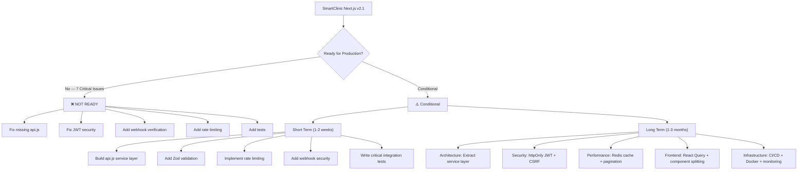

## Decision Matrix for CTO

| Criterion | Current Score | Target Score | Effort to Close |
|-----------|--------------|--------------|-----------------|
| **Security Posture** | 3/10 | 8/10 | 4 weeks |
| **Code Quality** | 5/10 | 8/10 | 6 weeks |
| **Test Coverage** | 0/10 | 7/10 | 8 weeks |
| **Scalability** | 4/10 | 7/10 | 4 weeks |
| **Developer Experience** | 4/10 | 8/10 | 3 weeks |
| **Documentation** | 5/10 | 8/10 | 2 weeks |
| **Onboarding Time** | ~3 days | ~2 hours | 2 weeks |

**Verdict:** ❌ **Not ready for production deployment.** The 7 critical issues — especially the missing `api.js` file (which makes the entire frontend inoperable), localStorage JWT vulnerability, and zero test coverage — represent unacceptable risk. Recommend a **4-week hardening sprint** before any production deployment. The foundation is solid (Prisma schema, architecture patterns, feature scope), but security, testing, and missing implementation gaps must be addressed first.

---

*Report generated from comprehensive codebase analysis. All findings reference specific files and line numbers where available. Recommendations are prioritized by business impact and implementation effort.*
