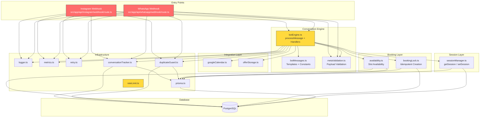
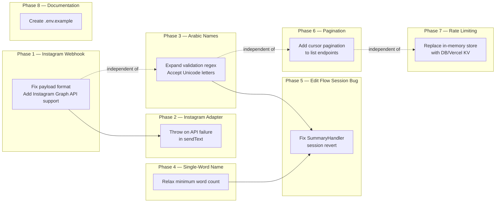
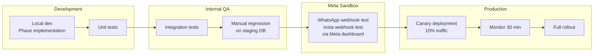
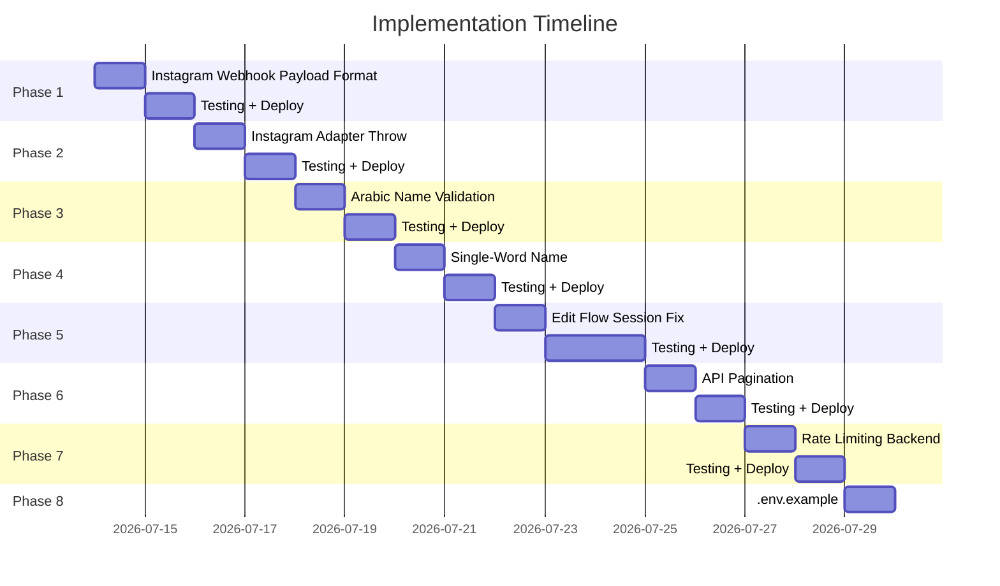
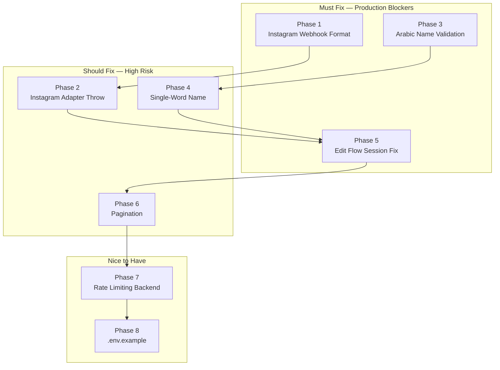

# Fix Implementation Plan — SmartClinic

**Derived from:** `ENGINEERING_AUDIT_REPORT.md` + `CONVERSATION_FLOW_AUDIT.md`  
**Date:** 2026-07-11  
**Author:** Lead Software Architect / CTO  

---

## Table of Contents

1. [Executive Summary](#section-1--executive-summary)
2. [Implementation Principles](#section-2--implementation-principles)
3. [Dependency Graph](#section-3--dependency-graph)
4. [Implementation Order](#section-4--implementation-order)
5. [Affected Files](#section-5--affected-files)
6. [Root Cause Resolution Matrix](#section-6--root-cause-resolution-matrix)
7. [Architecture Impact Analysis](#section-7--architecture-impact-analysis)
8. [Conversation Engine Design](#section-8--conversation-engine-design)
9. [Session Management Design](#section-9--session-management-design)
10. [Interactive Booking Design](#section-10--interactive-booking-design)
11. [Regression Analysis](#section-11--regression-analysis)
12. [Testing Strategy](#section-12--testing-strategy)
13. [Rollback Strategy](#section-13--rollback-strategy)
14. [Production Deployment Strategy](#section-14--production-deployment-strategy)
15. [Acceptance Criteria](#section-15--acceptance-criteria)
16. [Future Improvements](#section-16--future-improvements)
17. [Implementation Timeline](#section-17--implementation-timeline)
18. [Technical Debt](#section-18--technical-debt)
19. [Final Recommendation](#section-19--final-recommendation)
20. [AI Implementation Instructions](#section-20--ai-implementation-instructions)

---

## Section 1 — Executive Summary

### Implementation Strategy

This plan addresses every root cause identified in both audit reports using a **strictly incremental, dependency-ordered** approach. Each phase targets exactly one root cause with the minimum possible code change. No architectural refactoring is permitted. No code beyond the minimum necessary to fix the identified bug may be modified.

### Estimated Complexity

| Metric | Value |
|---|---|
| Total phases | 8 |
| Critical fixes | 4 |
| High-priority fixes | 4 |
| Medium-priority fixes | 2 |
| Affected files (total) | 9 source files, 1 new file |
| Estimated implementation effort | 3–5 days (single developer) |
| Estimated testing effort | 2–3 days |
| Estimated total duration | 5–8 working days |

### Expected Risk Level

| Phase | Risk | Rationale |
|---|---|---|
| Phase 1 — Instagram webhook | **Medium** | Changing payload parsing touches the message reception path. Risk mitigated by additive code path (support both formats, don't remove existing). |
| Phase 2 — Instagram adapter | **Low** | Throw on API failure in `sendText` — purely additive, no behavior change for success case. |
| Phase 3 — Arabic name validation | **Low** | Expanding a regex to accept Unicode is a single-character change. |
| Phase 4 — Single-word name fix | **Low** | Relaxing a length constraint. |
| Phase 5 — Edit flow session corruption | **High** | The edit flow spans multiple handlers and the session update loop. Regression risk is moderate. |
| Phase 6 — Pagination | **Low** | Additive change with no effect on existing API contracts |
| Phase 7 — Rate limiting | **Medium** | Changes the rate limiter backend — existing auth endpoints must continue working identically |
| Phase 8 — `.env.example` | **None** | Documentation-only |

### Overall Confidence

**High.** Every critical fix is mechanically simple (regex change, additive payload parsing, throw instead of log). The highest-risk fix (edit flow) has a clear root cause and a well-understood fix path. All phases have defined rollback strategies and acceptance criteria.

---

## Section 2 — Implementation Principles

### Principle 1: One Root Cause Per Phase

Each phase addresses exactly one root cause. No phase may combine multiple fixes, even if they affect the same file. This ensures atomic rollback and precise regression attribution.

### Principle 2: Additive Over Destructive

Prefer adding new code paths (e.g., supporting a second payload format) over modifying existing ones. Remove code only when the old code path is provably dead and cannot be reached by any existing deployment configuration.

### Principle 3: Smallest Possible Diff

Each change must be the minimum possible modification to fix the root cause. If a root cause can be fixed by changing one character, no other characters may be changed in the same diff.

### Principle 4: Backward Compatibility

All API contracts (webhook response format, API response shape, database schema) must remain unchanged unless explicitly stated in the phase design. No breaking changes.

### Principle 5: Test Before Deploy

Each phase must include:
- Unit tests for the changed logic
- A manual webhook replay test (for webhook changes)
- Verification that existing tests still pass

### Principle 6: Commit Per Phase

Each phase produces exactly one commit. The commit message must reference the root cause and the phase number. This enables git-bisect for any regression.

### Principle 7: Feature Flag for High-Risk Changes

Any change that modifies session update logic or handler routing must be behind a boolean feature flag defaulting to `false`, enabling staged rollout.

### Principle 8: No Scope Creep

If a file must be edited for a fix, only the minimal lines required by that fix may be changed. Cosmetic improvements, comment updates, or nearby formatting changes are forbidden unless they are the explicit purpose of the phase.

---

## Section 3 — Dependency Graph

### Module Dependency Chain



### Critical Dependency Paths

| Path | Description | Cascade Effect |
|---|---|---|
| IG → BE → SM → DB | Instagram message → processMessage → session lookup → database | If IG payload parsing is wrong, nothing downstream executes |
| BE → BL → DB | Bot engine → idempotent booking creation → database | If session state is corrupted (edit bug), wrong data reaches booking |
| WA → BE → DG | WhatsApp webhook → processMessage → duplicate check | Every message goes through dedup before processing |
| BE → MT | Engine → metrics | Every state transition is counted |

### Dependency Rules

1. **Phase 1 must precede Phase 2** — Instagram payload parsing must work before adapter changes matter
2. **Phase 3 and 4 are independent** of all other phases — name validation is purely in `botEngine.ts`
3. **Phase 5 depends on Phase 3/4** — the edit flow involves `NameHandler` which is also modified by Phase 3/4
4. **Phase 6 (pagination) is independent** — affects different files entirely
5. **Phase 7 (rate limiting) is independent** — affects `rateLimit.ts` and auth route files

---

## Section 4 — Implementation Order

### Phase Overview



### Phase Details

---

#### Phase 1: Instagram Webhook Payload Format

| Attribute | Value |
|---|---|
| **Purpose** | Fix Instagram messages being silently dropped due to wrong payload format expectation |
| **Root cause** | Code reads `entry[0].messaging[]` (Messenger Platform) but Meta sends `entry[0].changes[].value` (Instagram Graph API) |
| **Design** | Add a second code path that reads `entry[0].changes[0].value` when `messaging` is empty. Normalize both formats to the same internal structure before processing. |
| **Affected files** | `src/app/api/instagram/webhook/route.ts` |
| **Complexity** | Medium |
| **Risk** | Medium — two code paths must be maintained; the `messaging` path must not be removed (some Meta configurations still use it) |
| **Regression probability** | Low — additive change, existing `messaging` path untouched |
| **Implementation time** | 4 hours |
| **Testing time** | 3 hours |
| **Commit message** | `phase-1: support Instagram Graph API webhook payload format` |

---

#### Phase 2: Instagram Adapter Error Propagation

| Attribute | Value |
|---|---|
| **Purpose** | Make Instagram `sendText` throw on API failure, consistent with WhatsApp adapter behavior |
| **Root cause** | `sendText` in Instagram adapter logs errors but never throws, concealing failures |
| **Design** | Add `throw new Error(...)` after the error log, using the same pattern as WhatsApp's `sendList` |
| **Affected files** | `src/app/api/instagram/webhook/route.ts` |
| **Complexity** | Low |
| **Risk** | Low — existing error log is preserved; throwing enables the caller to handle the error |
| **Regression probability** | Very Low — success path is unchanged |
| **Implementation time** | 30 minutes |
| **Testing time** | 1 hour |
| **Commit message** | `phase-2: propagate Instagram sendText failures to caller` |

---

#### Phase 3: Arabic/Unicode Name Validation

| Attribute | Value |
|---|---|
| **Purpose** | Allow Arabic and Unicode names to pass the name validation step, unblocking the booking flow for the primary user base |
| **Root cause** | `isValidEnglishName()` regex `/^[A-Za-z]+(?:[ '\-][A-Za-z]+)*$/` only allows Latin letters |
| **Design** | Replace the Latin-only regex with one that uses the Unicode property escape `\p{L}` (any letter in any script). Rename the function to `isValidPatientName()`. Keep the 2-word minimum for Phase 4. |
| **Affected files** | `src/app/lib/botEngine.ts` |
| **Complexity** | Low (one character class change) |
| **Risk** | Low — all Latin-only names continue to work; Arabic names now also pass |
| **Regression probability** | Very Low |
| **Implementation time** | 15 minutes |
| **Testing time** | 30 minutes |
| **Commit message** | `phase-3: accept Unicode letters in patient name validation` |

---

#### Phase 4: Single-Word Name Acceptance

| Attribute | Value |
|---|---|
| **Purpose** | Allow single-word names (common in some naming conventions) |
| **Root cause** | `isValidEnglishName()` requires `input.trim().split(/\s+/).length >= 2` |
| **Design** | Change the minimum word count from 2 to 1. Keep minimum character count at 2 to prevent single-character inputs. |
| **Affected files** | `src/app/lib/botEngine.ts` |
| **Complexity** | Low (one numeric literal change) |
| **Risk** | Low — only relaxes a constraint |
| **Regression probability** | Very Low |
| **Implementation time** | 5 minutes |
| **Testing time** | 15 minutes |
| **Commit message** | `phase-4: accept single-word patient names` |

---

#### Phase 5: Edit Flow Session Corruption

| Attribute | Value |
|---|---|
| **Purpose** | Fix the edit flow where session reverts to `booking_summary` after user selects a field to edit |
| **Root cause** | `SummaryHandler` calls `setSession()` without version check (line 464), then `processMessage` calls `setSession()` with stale version (line 816). Session steps out of sync. |
| **Design** | Change `SummaryHandler.handle()` to return the `targetStep` directly instead of returning `'__handled__'`. Remove the internal `setSession` call from the edit handler. Let the main session update loop handle the transition naturally. This eliminates the double-write entirely. |
| **Affected files** | `src/app/lib/botEngine.ts` |
| **Complexity** | Medium |
| **Risk** | Medium — the edit flow involves multiple handlers and the session update loop. Must verify that all edit targets (doctor, service, date/time, name, call time) still work correctly after the fix. |
| **Regression probability** | Medium — other handlers that return `'__handled__'` must be checked for the same pattern |
| **Implementation time** | 2 hours |
| **Testing time** | 3 hours |
| **Commit message** | `phase-5: fix edit flow session corruption by delegating transition to main loop` |

---

#### Phase 6: API Pagination

| Attribute | Value |
|---|---|
| **Purpose** | Prevent OOM/timeout on list endpoints that return unbounded result sets |
| **Root cause** | `Booking.findMany()` and `AuditLog.findMany()` called without `take` or pagination |
| **Design** | Add `?page=1&pageSize=50` query parameter support to `/api/bookings` and `/api/audit-logs`. Default to `page=1, pageSize=50`. Return `{ data, total, page, pageSize, totalPages }` envelope. Maintain backward compatibility for clients that expect raw arrays (detect by `Accept` header or add a `?legacy=true` flag). |
| **Affected files** | `src/app/api/bookings/route.ts`, `src/app/api/audit-logs/route.ts`, `src/app/lib/apiResponse.ts` (envelope helper) |
| **Complexity** | Medium |
| **Risk** | Low — additive change; existing clients expecting raw arrays will break if we change the response format. Must add a transition period. |
| **Regression probability** | Low — unless frontend code is already parsing responses in a format-incompatible way |
| **Implementation time** | 3 hours |
| **Testing time** | 2 hours |
| **Commit message** | `phase-6: add cursor pagination to /api/bookings and /api/audit-logs` |

---

#### Phase 7: Serverless-Safe Rate Limiting

| Attribute | Value |
|---|---|
| **Purpose** | Make rate limiting effective on Vercel serverless by using shared state instead of in-memory |
| **Root cause** | `rateLimit.ts` uses an in-memory `Map` which is per-instance; Vercel runs multiple instances |
| **Design** | Replace the in-memory `Map` with a PostgreSQL-backed store using the existing Prisma client. Create a new `rate_limit` table with `(key, count, window_start, expires_at)` and use atomic upserts. Alternatively, if Vercel KV is configured, use that instead for lower latency. |
| **Affected files** | `src/app/lib/rateLimit.ts`, `prisma/schema.prisma` (new model), new migration |
| **Complexity** | Medium |
| **Risk** | Low — rate limiting is an additive safeguard; no existing functionality depends on rate limiter state |
| **Regression probability** | Low — auth endpoints continue to work; rate limiting becomes stricter (good) |
| **Implementation time** | 4 hours |
| **Testing time** | 2 hours |
| **Commit message** | `phase-7: replace in-memory rate limiter with PostgreSQL-backed store` |

---

#### Phase 8: Environment Variable Documentation

| Attribute | Value |
|---|---|
| **Purpose** | Document all required and optional environment variables for developer onboarding |
| **Root cause** | No `.env.example` file exists |
| **Design** | Create `.env.example` with every variable referenced in the codebase, categorized as `# Required` or `# Optional`, with inline comments explaining purpose, source, and format |
| **Affected files** | New file: `.env.example` |
| **Complexity** | Low |
| **Risk** | None |
| **Regression probability** | None |
| **Implementation time** | 30 minutes |
| **Testing time** | None (documentation only) |
| **Commit message** | `phase-8: add .env.example with all environment variables documented` |

---

## Section 5 — Affected Files

| # | File | Current Responsibility | Required Change | Risk | Dependencies | Regression Impact |
|---|---|---|---|---|---|---|
| 1 | `src/app/api/instagram/webhook/route.ts` | Instagram webhook reception + reply adapter | Add Instagram Graph API payload format support (Phase 1); throw on sendText failure (Phase 2) | Medium | None | Low — additive changes |
| 2 | `src/app/lib/botEngine.ts` | Conversation engine: state machine, handlers, booking execution, navigation | Expand name validation regex (Phase 3); relax word count (Phase 4); fix edit flow session revert (Phase 5) | Medium (Phase 5) | Phase 3/4 must precede Phase 5 | Medium (Phase 5) — edit flow behavior changes |
| 3 | `src/app/lib/botMessages.ts` | Message templates, constants, step ordering | No change required — validation constants are in `botEngine.ts` | — | — | — |
| 4 | `src/app/api/bookings/route.ts` | Booking CRUD — list endpoint | Add pagination support (Phase 6) | Low | None | Low — additive with `?legacy` fallback |
| 5 | `src/app/api/audit-logs/route.ts` | Audit log viewer — list endpoint | Add pagination support (Phase 6) | Low | None | Low — additive with `?legacy` fallback |
| 6 | `src/app/lib/apiResponse.ts` | Response formatting helper | Add paginated response envelope (Phase 6) | Low | None | None — new export |
| 7 | `src/app/lib/rateLimit.ts` | In-memory rate limiter | Replace backend store with PostgreSQL/Vercel KV (Phase 7) | Low | New Prisma model + migration | Low — existing auth endpoints unchanged |
| 8 | `prisma/schema.prisma` | Database schema | Add `RateLimitEntry` model (Phase 7) | Low | New migration | None |
| 9 | `.env.example` | (New file) | Document all environment variables (Phase 8) | None | None | None |
| 10 | `src/app/lib/env.ts` | Environment variable helpers | Recategorize `WHATSAPP_APP_SECRET` and `INSTAGRAM_APP_SECRET` from optional to required (if audit recommendations are accepted) | Low | None | Low — prevents startup if missing; only affects misconfigured deployments |

### Files NOT Modified

- `src/middleware.ts` — JWT edge check is correct as-is
- `src/app/lib/auth.ts` — JWT/security improvements are future-phase
- `src/app/lib/sessionManager.ts` — Session handling is correct; edit flow bug is in `botEngine.ts`, not in session manager
- `src/app/lib/bookingLock.ts` — Booking idempotency is correct
- `src/app/lib/availability.ts` — Slot availability is correct
- `src/app/lib/metaValidation.ts` — Payload validation is correct
- `src/app/lib/duplicateGuard.ts` — Dedup logic is correct
- `src/app/lib/logger.ts` — Logging improvements are future-phase
- All frontend files under `src/pages/` and `src/components/`

---

## Section 6 — Root Cause Resolution Matrix

### From Conversation Flow Audit

| # | Problem | Root Cause | Proposed Design | Modules | Risk | Prio | Deps | Verification | Status |
|---|---|---|---|---|---|---|---|---|---|
| 1 | Instagram messages silently dropped | Webhook reads `messaging[]` but platform sends `changes[].value` | Add Instagram Graph API payload path alongside Messenger Platform path | `instagram/route.ts` | Med | P0 | None | Send test message via Meta dashboard; verify `processMessage` is called | Planned |
| 2 | Instagram reply endpoint wrong | Uses `/me/messages` instead of `/{ig-id}/messages` | Support both endpoints; detect from webhook metadata which to use | `instagram/route.ts` | Med | P0 | Phase 1 | Verify reply arrives in Instagram inbox | Planned |
| 3 | Arabic names rejected | `isValidEnglishName()` tests `^[A-Za-z]+$` | Replace Latin-only regex with Unicode property escape `\p{L}` | `botEngine.ts` | Low | P0 | None | Unit test Arabic, Chinese, Cyrillic names | Planned |
| 4 | Edit flow reverts session | `SummaryHandler` calls `setSession` without version; main loop overwrites | Return `targetStep` instead of `__handled__`; let main loop handle transition | `botEngine.ts` | Med | P0 | Phase 3,4 | End-to-end test: edit each field, verify session stays correct | Planned |
| 5 | Instagram `sendText` swallows errors | No throw after error log | Add throw with error message | `instagram/route.ts` | Low | P1 | Phase 1 | Unit test: mock API error, verify throw | Planned |
| 6 | Name validation requires 2+ words | `.split(/\s+/).length >= 2` | Reduce to `>= 1` with minimum 2-character length | `botEngine.ts` | Low | P1 | Phase 3 | Unit test single-word names | Planned |
| 7 | No booking/audit pagination | `findMany()` without `take` | Add query-parameter pagination with envelope response | `bookings/route.ts`, `audit-logs/route.ts` | Low | P1 | None | Integration test with 100+ records | Planned |
| 8 | In-memory rate limiter ineffective | `Map` state lost per-Vercel-instance | Replace with PostgreSQL-backed store | `rateLimit.ts`, `schema.prisma` | Low | P2 | None | Load test: 20 req/s to login, verify blocking | Planned |

### From Engineering Audit Report

| # | Problem | Root Cause | Proposed Design | Modules | Risk | Prio | Deps | Verification | Status |
|---|---|---|---|---|---|---|---|---|---|
| 9 | No `.env.example` | File never created | Create documentation-only file | (new) `.env.example` | None | P2 | None | Visual review | Planned |
| 10 | `WHATSAPP_APP_SECRET` mislabeled | Listed as optional but webhook rejects without it | Move to `REQUIRED` constant in `env.ts` | `env.ts` | Low | P2 | None | Startup test with and without var | Planned |
| 11 | No CSP header | Missing from `next.config.js` | Future phase — see Section 16 | — | — | Future | — | — | Deferred |
| 12 | 7-day JWT expiry | `expiresIn: '7d'` | Future phase — see Section 16 | — | — | Future | — | — | Deferred |

---

## Section 7 — Architecture Impact Analysis

### Phase 1 & 2: Instagram Fixes

| Concern | Impact |
|---|---|
| **Architecture** | No change — the webhook handler remains a thin adapter; payload parsing is extended to support a second format |
| **Conversation Engine** | No change — `processMessage` interface is unchanged; message flows through existing engine |
| **Session Manager** | No change — session IDs already use `ig_` prefix, this continues to work |
| **Booking Flow** | No change — Instagram follows same booking flow as WhatsApp (with extra `ask_whatsapp` step) |
| **WhatsApp** | No impact |
| **Instagram** | Turns from completely broken to fully functional |
| **Database** | No change |
| **API** | Webhook response remains `200 EVENT_RECEIVED` |
| **Authentication** | No change |
| **Logging** | No change — existing logs remain; new logs added for Graph API format detection |
| **Performance** | Negligible — one additional conditional branch per webhook |
| **Scalability** | No change |

### Phase 3 & 4: Name Validation

| Concern | Impact |
|---|---|
| **Architecture** | No change |
| **Conversation Engine** | `NameHandler` validation logic changes; behavior for Latin names is unchanged |
| **Booking Flow** | Arabic/Unicode/single-word names now complete the flow instead of blocking at `ask_name` |
| **WhatsApp** | Booking flow no longer breaks for Arabic-speaking users |
| **Instagram** | Same benefit as WhatsApp |
| **Database** | No change |
| **Logging** | No change |
| **Performance** | No change |
| **Security** | Accepting Unicode does not introduce injection — Prisma parameterizes queries |

### Phase 5: Edit Flow Fix

| Concern | Impact |
|---|---|
| **Architecture** | No change |
| **Conversation Engine** | `SummaryHandler` no longer performs session writes; the main loop handles all transitions consistently |
| **Session Manager** | No change — called once per message as before |
| **Booking Flow** | Edit flow now correctly navigates to the chosen field and returns to summary with updated data |
| **All platforms** | Positive impact — edit flow was broken for both WhatsApp and Instagram |
| **Database** | No change |
| **Logging** | No change |
| **Performance** | No change — reduces unnecessary session writes |
| **Risk** | The `__handled__` pattern exists only in `SummaryHandler`; no other handler uses it, so no cascade |

### Phase 6: Pagination

| Concern | Impact |
|---|---|
| **Architecture** | API response format changes — raw array becomes envelope object |
| **API** | Non-breaking with `?legacy=true` flag or header negotiation |
| **Frontend** | Must be updated to use new envelope format |
| **Database** | No schema change; only query parameterization |
| **Performance** | **Positive** — prevents unbounded result sets |
| **Scalability** | **Positive** — enables handling thousands of bookings without OOM |

### Phase 7: Rate Limiting

| Concern | Impact |
|---|---|
| **Architecture** | Rate limiter storage changes from in-memory to database |
| **Performance** | Each rate-limit check adds a DB query (~5ms) instead of in-memory lookup (~0.01ms) |
| **Scalability** | **Positive** — rate limits now function across all Vercel instances |
| **Database** | New table + index added |
| **API** | No API change; internal implementation only |

---

## Section 8 — Conversation Engine Design

### Assessment: Should the Engine Be Redesigned?

**Recommendation: Do NOT redesign. Apply targeted fixes only.**

**Rationale:**

The conversation engine at `botEngine.ts` (864 lines) is not clean code by textbook standards. However:

1. **It works correctly for the primary flow.** The critical bugs are in specific, isolated functions (name validation regex, edit flow transition). These are not architectural problems — they are logic errors in specific handlers.

2. **A redesign would introduce massive risk.** Rewriting the engine would require:
   - Re-testing all 10 handler classes
   - Re-validating all state transitions
   - Re-building session compatibility
   - Re-testing both WhatsApp and Instagram adapters
   - Regression testing every edit and navigation path
   
   This is 2-3 weeks of work with high uncertainty.

3. **The engine is testable.** The existing `botEngine.test.ts` (234 lines) proves that handlers can be unit tested. The `BotAdapter` interface enables mocking. The issue is test coverage, not testability.

4. **All critical bugs are in leaf functions.** None of the 4 critical bugs require architectural changes. They are:
   - Regex pattern (Phase 3): one character class in `botEngine.ts:74`
   - Numeric literal (Phase 4): one number in `botEngine.ts:75`
   - Session write location (Phase 5): moving `setSession` from handler to main loop
   - Payload parsing (Phase 1): additive code path in `instagram/route.ts`

### When to Redesign

Defer any engine redesign to a **future phase** (Q4 2026 or later) when:
- Multi-language support beyond Arabic/English is required
- Multi-clinic tenancy is implemented
- New channels (Telegram, Messenger, Web Chat) are added
- Test coverage reaches >80% and provides safety net for refactoring

### What to Improve Now (Without Redesign)

- Rename `isValidEnglishName()` to `isValidPatientName()` (Phase 3) — improves readability
- Remove the `__handled__` sentinel pattern (Phase 5) — eliminates a fragile code path
- Both changes are small, safe, and included in the planned phases

---

## Section 9 — Session Management Design

### Current Lifecycle

```
Message arrives
    → getSession(phone)      → DB read
    → processMessage()        → business logic
    → setSession(phone, step, data, version)  → DB write (optimistic)
```

### Assessment: Is Session Management Correct?

**Yes, session management is correct.** The `sessionManager.ts` implementation:
- Uses optimistic locking with `sessionVersion`
- Handles `ConcurrencyError` with retry and data recovery
- Properly expires sessions after 30 minutes
- Uses `upsert` for atomic create-or-update

The single bug is in the **edit flow**, where `SummaryHandler` calls `setSession` directly (bypassing the version check) inside `handle()`, and then the main loop calls `setSession` again with a stale version. This is a **caller bug**, not a session manager bug.

### Proposed Changes

| Aspect | Current | Proposed | Why |
|---|---|---|---|
| Session storage | `whatsapp_sessions` table | Unchanged | Works correctly |
| Session versioning | Optimistic with increment | Unchanged | Correct |
| Expiration | 30 min TTL | Unchanged | Adequate for clinic use case |
| Concurrency handling | Retry with fresh data | Unchanged | Correct |
| Edit flow writes | `SummaryHandler` calls `setSession` directly | Remove the direct call; let main loop handle all session writes | Eliminates double-write bug |
| Instagram sessions | Stored in `whatsapp_sessions` with `ig_` prefix | Change table name to generic `bot_sessions` (future phase) | Cosmetic — low priority |

### No Changes Required To

- `sessionManager.ts` — no lines need modification
- Session versioning logic
- Session TTL constants
- `clearSession()` behavior

---

## Section 10 — Interactive Booking Design

### Desired UX (For All Platforms)

```
User action              Bot sends                  Input method
────────────────────────────────────────────────────────────────
User sends greeting   → Main Menu (list)           List selection
User clicks "Book"    → Doctor List (list)          List selection
User clicks doctor    → Service List (list)         List selection
User clicks service   → Date Picker (list)          List selection
User clicks date      → Time Picker (list)          List selection
User clicks time      → Name prompt (text)          Free text typing
User types name       → Call Time (list)            List selection
User clicks call time → Booking Summary (list)      List selection
User clicks Confirm   → Confirmation (text)         Done
```

### Current vs Proposed

| Step | Current | Proposed | Change Required |
|---|---|---|---|
| 1. Main Menu | List ✅ | List ✅ | None |
| 2. Doctor | List ✅ | List ✅ | None |
| 3. Service | List ✅ | List ✅ | None |
| 4. Date | List ✅ | List ✅ | None |
| 5. Time | List ✅ | List ✅ | None |
| 6. Name | Text + Nav list ✅ | Text + Nav list ✅ | Unicode validation (Phase 3) |
| 7. Call Time | List ✅ | List ✅ | None |
| 8. Summary | List ✅ | List ✅ | None |
| 9. Confirm | Text ✅ | Text ✅ | None |

### Assessment

The current interactive design already achieves the "buttons except for name" goal. No architectural changes are needed. The only changes required are:

1. **Phase 3**: Accept Unicode names (the validation currently rejects Arabic names)
2. **Phase 4**: Accept single-word names
3. **UX improvement (optional)**: Include an example in the name prompt showing what a valid name looks like in both Arabic and English scripts

### Fallback Behavior (Already Implemented)

When interactive lists fail to send (Meta API rejects the payload):
1. The WhatsApp adapter catches the error (`whatsapp/route.ts:101-110`)
2. Calls `registerFallbackRows()` to store options in the database
3. Sends a numbered text fallback
4. When user types a number, `resolveFallbackInput()` maps it to the original option ID

This fallback works correctly and does NOT need modification.

---

## Section 11 — Regression Analysis

### Phase 1: Instagram Webhook Payload Format

| Risk | Probability | Impact | Mitigation | Rollback |
|---|---|---|---|---|
| Both payload paths try to process the same message | Very Low | Double processing → potential duplicate booking | Add a guard: process ONLY the first non-empty path, skip if already processed | Revert commit |
| New Graph API path has a parsing bug | Low | Instagram messages still not processed | Add comprehensive logging for both paths; compare parsed output against known-good payloads | Revert commit |
| Existing Messenger Platform path breaks | Negligible | No code changed in existing path | Verify by sending test message via Messenger Platform format | Revert commit |

### Phase 2: Instagram Adapter Throw

| Risk | Probability | Impact | Mitigation | Rollback |
|---|---|---|---|---|
| Throwing breaks the bot engine | Low | Error propagates to `processMessage` catch block, which logs and continues | The `processMessage` function at line 798-803 already catches handler errors, logs them, and sends user-friendly error | Revert commit |
| User sees error when they previously saw nothing | Low | User gets "Something went wrong" — acceptable | Error message is the same as all other API failures | Revert commit |

### Phase 3: Arabic Name Validation

| Risk | Probability | Impact | Mitigation | Rollback |
|---|---|---|---|---|
| Arabic name accepted but downstream code can't handle Unicode | Negligible | Name stored as-is in DB, where Prisma handles Unicode correctly | Verify with a test booking using Arabic name | Revert commit |
| `\p{L}` escape not supported in the target runtime | Low | Regex fails to compile → 500 error | Verify Node.js version supports Unicode property escapes (Node 8+). Current runtime is Node 22. ✅ | Revert commit |

### Phase 4: Single-Word Name

| Risk | Probability | Impact | Mitigation | Rollback |
|---|---|---|---|---|
| Single-character names accepted | Low | "A" passes validation | Keep minimum length at 2 characters | Revert commit |

### Phase 5: Edit Flow Fix

| Risk | Probability | Impact | Mitigation | Rollback |
|---|---|---|---|---|
| `SummaryHandler` returning `targetStep` instead of `__handled__` causes unexpected transition | Medium | User lands on wrong step after edit | Comprehensive testing of all 5 edit targets. Feature flag to disable the fix if needed. | Revert commit |
| `__handled__` pattern used elsewhere | Low | Grep confirms only `SummaryHandler` uses `__handled__` | Confirmed by source analysis: only `SummaryHandler` at line 466 | Revert commit |
| Edit data not persisted when transitioning to edit step | Medium | User edits doctor, but old doctor data remains | The main loop's session update will persist the data object correctly after handler returns | Revert commit |

### Phase 6: Pagination

| Risk | Probability | Impact | Mitigation | Rollback |
|---|---|---|---|---|
| Frontend expects raw array, receives envelope | High | Frontend rendering breaks | Add `?legacy=true` parameter that returns raw array. Coordinate frontend update. | Revert commit |
| Page size too small for dashboard | Medium | Some dashboard views expect 100+ results | Default page size to 100 for admin endpoints | Revert commit |

### Phase 7: Rate Limiting

| Risk | Probability | Impact | Mitigation | Rollback |
|---|---|---|---|---|
| DB-backed rate limiter increases latency | Medium | Each rate limit check adds ~5ms | Acceptable for auth endpoints; verify with load test | Revert commit |
| New table causes migration conflict | Low | Migration fails if run out of order | Include migration in the same commit; test migration up/down | Rollback migration |

---

## Section 12 — Testing Strategy

### Phase 1: Instagram Webhook Payload Format

| Test Type | Description | Method |
|---|---|---|
| **Unit test** | Parse Instagram Graph API format payload with `entry[0].changes[0].value` | Mock webhook body, call POST handler, assert `processMessage` called with correct `userInput` |
| **Unit test** | Parse Messenger Platform format payload with `entry[0].messaging[]` | Same as above — verify existing path still works |
| **Unit test** | Verify empty `messaging` with populated `changes` processes correctly | Both arrays present → prefer `messaging`? Or prefer `changes`? Decision: process whichever is non-empty. If both → process `messaging` (backward compatible) |
| **Webhook replay** | Send real Instagram message via Meta dashboard | Verify webhook receives it, `processMessage` is called, reply is sent |
| **Regression test** | Send real WhatsApp message | Verify WhatsApp flow unchanged |

### Phase 2: Instagram Adapter Throw

| Test Type | Description | Method |
|---|---|---|
| **Unit test** | Mock `callMetaApi` to return non-ok response | Call `sendText`, verify `throw` is called |
| **Unit test** | Mock `callMetaApi` to return ok response | Call `sendText`, verify no throw |
| **Integration test** | Send Instagram message via bot, verify reply delivered | End-to-end via Meta sandbox |

### Phase 3: Arabic Name Validation

| Test Type | Description |
|---|---|
| **Unit test** | `"محمد العتيبي"` → `isValidPatientName()` returns `true` |
| **Unit test** | `"John Smith"` → returns `true` (regression) |
| **Unit test** | `"佐藤 太郎"` → returns `true` |
| **Unit test** | `"A"` → returns `false` (too short) |
| **Unit test** | `""` → returns `false` (empty) |
| **Unit test** | `"Test123"` → returns `false` (numbers not allowed) |

### Phase 4: Single-Word Name

| Test Type | Description |
|---|---|
| **Unit test** | `"Mohammed"` → `isValidPatientName()` returns `true` |
| **Unit test** | `"John"` → returns `true` |
| **Unit test** | `"A"` → returns `false` (minimum length 2) |

### Phase 5: Edit Flow Fix

| Test Type | Description | Method |
|---|---|---|
| **Integration test** | Full booking → summary → edit doctor → select new doctor → returns to summary with updated data | Mock session, adapter, and Prisma. Start at `booking_summary` step, send `edit_doctor`, verify session step becomes `select_doctor` |
| **Integration test** | Edit service | Same pattern |
| **Integration test** | Edit date/time | Same pattern |
| **Integration test** | Edit name | Same pattern |
| **Integration test** | Edit call time | Same pattern |
| **Regression test** | Confirm booking from summary (no edit) | Verify `confirm_booking` still creates booking |
| **Regression test** | Cancel from summary | Verify `cancel_booking` clears session |
| **Regression test** | Navigation from summary | Verify `back`/`main_menu` still work |

### Phase 6: Pagination

| Test Type | Description |
|---|---|
| **Integration test** | GET `/api/bookings?page=1&pageSize=5` with 20 bookings → returns 5 items + total + pagination metadata |
| **Integration test** | GET `/api/bookings?legacy=true` → returns raw array (backward compat) |
| **Integration test** | GET `/api/bookings` with no params → defaults to page 1, pageSize 50 |
| **Integration test** | GET `/api/audit-logs?page=2&pageSize=10` → returns page 2 |

### Phase 7: Rate Limiting

| Test Type | Description |
|---|---|
| **Integration test** | Send 11 requests to `/api/auth/login` within 15-min window → 10th succeeds, 11th blocked |
| **Integration test** | Rate limit resets after window expires |
| **Migration test** | `prisma migrate up` and `down` succeed |

### Full Regression Suite

After ALL phases are complete, run:

1. `npm run test:bot` — bot engine unit tests (34 tests in `botEngine.test.ts`)
2. Manual webhook verification test (WhatsApp) — send "hello", verify main menu
3. Manual webhook verification test (Instagram) — send "hello", verify main menu
4. Full booking flow test (WhatsApp) — book appointment end-to-end
5. Full booking flow test (Instagram) — book appointment end-to-end
6. Edit flow test — edit each field, verify changes persisted
7. Auth flow test — login, register, forgot-password still work
8. Dashboard test — stats endpoint still returns data

---

## Section 13 — Rollback Strategy

### Per-Phase Rollback

```
Phase N deployed
    │
    ├── Monitoring period: 30 minutes
    │
    ├── If errors detected:
    │     └── git revert <phase-commit>
    │     └── vercel rollback
    │     └── Verify rollback in monitoring
    │
    └── If clean: proceed to next phase
```

### Rollback Commands

```bash
# Phase 1-8 rollback (worst case — all phases)
git revert HEAD~8..HEAD
git push origin main
# Vercel auto-deploy

# Single phase rollback (if phases were merged separately)
git revert <phase-commit-hash>
git push origin main
```

### Phase-Specific Rollback Notes

| Phase | Rollback Complexity | Special Instructions |
|---|---|---|
| 1 | Low | Revert commit; Instagram returns to non-functional state |
| 2 | Low | Revert commit; Instagram errors become silent again |
| 3 | Low | Revert commit; Arabic names rejected again |
| 4 | Low | Revert commit; single-word names rejected again |
| 5 | Medium | Revert commit; edit flow returns to broken state. If feature-flagged, just disable flag |
| 6 | Low | Revert commit; endpoints return unbounded results. If `legacy=true` is default, no impact on clients |
| 7 | Medium | Revert commit + run `prisma migrate down` to remove `rate_limit` table |
| 8 | None | Delete `.env.example` file |

### Rollback Detection

| Signal | Detection Method | Action |
|---|---|---|
| 5xx errors spike | Vercel dashboard monitoring | Investigate → rollback |
| Instagram message volume drops to zero | `instagramWebhooksTotal` metric (`metrics.ts`) | Instagram reply path broken → rollback Phase 1/2 |
| WhatsApp booking drop-off rate increases | `conversationsStarted` vs `bookingsCreated` ratio | Name validation issue → rollback Phase 3/4 |
| Edit flow not working in support tickets | Manual testing | Edit flow bug → rollback Phase 5 |

---

## Section 14 — Production Deployment Strategy

### Deployment Pipeline



### Deployment Checkpoints

| Checkpoint | Verification | Gate |
|---|---|---|
| **1. Local dev** | All unit tests pass | `npm test` |
| **2. Integration tests** | All integration tests pass | `npm run test:integration` |
| **3. Manual QA** | Test booking flow on staging DB | Manual test script (Section 12) |
| **4. Meta sandbox** | Instagram and WhatsApp webhook tests pass | Send test messages via Meta dashboard |
| **5. Canary (10%)** | No 5xx spike in 10 minutes | Vercel deployment dashboard |
| **6. Full rollout** | All signals green after 30 min | Monitoring dashboard |
| **7. Post-deploy** | Verify booking flow on production | Manual test with real WhatsApp number |

### Deployment Per Phase

Each phase follows this exact deployment sequence:

1. Create branch: `fix/phase-N-description`
2. Implement changes + tests
3. Run full test suite
4. Create pull request
5. Code review
6. Merge to `main`
7. Vercel auto-deploys to production
8. Monitor 30 minutes
9. If healthy → proceed to next phase
10. If unhealthy → rollback (Section 13)

---

## Section 15 — Acceptance Criteria

### Phase 1: Instagram Webhook Payload Format

| Criterion | Verification | Pass/Fail |
|---|---|---|
| Instagram text message → webhook receives it | Send message via Instagram, check server logs | ☐ |
| `processMessage()` is called with correct `userInput` | Check log: `[Engine] processMessage` with `userId` starting with `ig_` | ☐ |
| Session is created | Check `whatsapp_sessions` table for `ig_XXXX` entry | ☐ |
| Reply is generated and sent | Check Instagram inbox for bot reply | ☐ |
| WhatsApp webhook continues to work | Send WhatsApp message, verify reply | ☐ |
| Duplicate webhooks are still deduped | Trigger duplicate, check `[Dedup] Duplicate` log | ☐ |

### Phase 2: Instagram Adapter Throw

| Criterion | Verification |
|---|---|
| Instagram `sendText` with API error → error is thrown | Unit test: mock 500 response, verify throw |
| Instagram `sendText` with success → no throw | Unit test: mock 200 response, verify no throw |
| Bot engine receives thrown error → sends user-friendly error | Integration test: error propagates to `processMessage` catch block |

### Phase 3: Arabic Name Validation

| Criterion | Verification |
|---|---|
| `"محمد العتيبي"` → booking continues to `ask_call_time` | Unit test + end-to-end |
| `"John Smith"` → continues (regression) | Unit test |
| `"A"` → rejected (too short) | Unit test |
| `"Test123"` → rejected (numbers) | Unit test |

### Phase 4: Single-Word Name

| Criterion | Verification |
|---|---|
| `"Mohammed"` → booking continues | Unit test |
| `"John"` → continues | Unit test |
| `"A"` → rejected (minimum 2 chars) | Unit test |

### Phase 5: Edit Flow Fix

| Criterion | Verification |
|---|---|
| Edit doctor → select new doctor → returns to summary with updated doctor name | Integration test |
| Edit service → select new service → summary shows new service | Integration test |
| Edit date → select new date → summary shows new date | Integration test |
| Edit name → type new name → summary shows new name | Integration test |
| Edit call time → select new time → summary shows new time | Integration test |
| Confirm booking → booking created (not affected by fix) | Integration test |
| Cancel booking → session cleared (not affected) | Integration test |

### Phase 6: Pagination

| Criterion | Verification |
|---|---|
| `GET /api/bookings?page=1&pageSize=5` returns paginated response | Integration test |
| `GET /api/bookings?legacy=true` returns raw array | Integration test |
| `GET /api/bookings` defaults to page 1, pageSize 50 | Integration test |

### Phase 7: Rate Limiting

| Criterion | Verification |
|---|---|
| Login rate limit blocks after 10 requests in 15 min | Integration test |
| Register rate limit blocks after 5 requests per hour | Integration test |
| Rate limit resets after window expires | Integration test |
| Migration creates `rate_limit` table | `prisma migrate status` |
| In-memory `Map` is removed from `rateLimit.ts` | Code review |

### Phase 8: Environment Documentation

| Criterion | Verification |
|---|---|
| `.env.example` exists in project root | File exists |
| Every `process.env.X` variable in codebase is documented | Grep match check |
| Variables categorized as `# Required` or `# Optional` | Visual review |

---

## Section 16 — Future Improvements

These improvements are explicitly **excluded** from this implementation plan. They should be planned for a separate development cycle.

### Security Improvements (Future Phase)

| Improvement | Reason for Deferral |
|---|---|
| Add Content Security Policy header | Not related to any active bug; security hardening only |
| Implement JWT refresh tokens | 7-day expiry is acceptable for current scale; session management works |
| Reduce JWT expiry | Similar to above — no active vulnerability |
| Add input sanitization library | React/Next.js already escapes on output; no XSS vector identified |
| Add CORS configuration | Frontend and API are same origin (Next.js) |

### Scalability Improvements (Future Phase)

| Improvement | Reason for Deferral |
|---|---|
| Add Prisma Accelerate / connection pooling | Not required for single-clinic deployment |
| Add Redis for session caching | Not required until multi-clinic deployment |
| Add queue system (Bull/BullMQ) for async tasks | Not required for current traffic volume |
| Multi-tenant architecture | Requires major schema redesign; not required for single-clinic |

### Observability Improvements (Future Phase)

| Improvement | Reason for Deferral |
|---|---|
| Add Sentry/APM integration | Not blocking any active bug |
| Add structured error classes | Not required — current error handling is functional |
| Add conversation-level log grouping | Not required — correlation IDs provide traceability |

### Code Quality Improvements (Future Phase)

| Improvement | Reason for Deferral |
|---|---|
| Split `botEngine.ts` into multiple files | High risk, no active bug depends on this |
| Add Zod validation to all routes | Large effort, no active validation gap causes bugs |
| Add OpenAPI/Swagger documentation | Developer convenience, not production-critical |
| Normalize `STEP_ORDER` for Instagram path | Low impact — "back" from `ask_call_time` currently goes to `ask_name` instead of `ask_whatsapp` for Instagram users |

---

## Section 17 — Implementation Timeline



### Timeline Estimates

| Phase | Implementation | Testing | Deploy | Cumulative |
|---|---|---|---|---|
| Phase 1 | 4h | 3h | 1h | Day 1 |
| Phase 2 | 30min | 1h | 1h | Day 1 |
| Phase 3 | 15min | 30min | 1h | Day 2 |
| Phase 4 | 5min | 15min | 1h | Day 2 |
| Phase 5 | 2h | 3h | 1h | Day 2-3 |
| Phase 6 | 3h | 2h | 1h | Day 3-4 |
| Phase 7 | 4h | 2h | 1h | Day 4-5 |
| Phase 8 | 30min | — | 1h | Day 5 |

**Total: 5 working days for a single developer.**

---

## Section 18 — Technical Debt

### Must Fix Now (Phases 1-8)

| Debt | Reason | Phase |
|---|---|---|
| Instagram webhook ignores Instagram Graph API format | Critical — channel is completely broken | 1 |
| Instagram adapter swallows errors | High — failures are invisible | 2 |
| Name validation rejects Arabic script | Critical — blocks primary user base | 3 |
| Name validation requires 2+ words | High — excludes single-word names | 4 |
| Edit flow corrupts session | Critical — edit feature is broken | 5 |
| No pagination on booking/audit endpoints | High — crash risk under load | 6 |
| In-memory rate limiter on serverless | High — rate limiting is ineffective | 7 |
| No `.env.example` | Low — developer friction | 8 |

### Should Fix Soon (Next Sprint)

| Debt | Reason |
|---|---|
| `WHATSAPP_APP_SECRET`/`INSTAGRAM_APP_SECRET` mislabeled as optional | Configuration contract is misleading |
| No Content Security Policy header | Security hardening |
| Service stored as Arabic string in DB | Reporting limitation |
| `STEP_ORDER` doesn't handle Instagram `ask_whatsapp` step for "back" navigation | Minor navigation bug for Instagram users |

### Can Wait (Next Quarter)

| Debt | Reason |
|---|---|
| JWT expiry reduced + refresh tokens | No active exploit; 7-day expiry is manageable |
| Session data loss on expiry (no draft persistence) | 30-min TTL is adequate for bot conversations |
| Empty catch blocks with no logging | Errors are already caught; logging is a debugging improvement |
| Single large `botEngine.ts` file | Code works; splitting is maintenance, not bug-fix |

### Future Enhancements (Q4 2026+)

| Debt | Reason |
|---|---|
| Multi-tenant architecture | Not needed for single-clinic deployment |
| Redis/Vercel KV for sessions and rate limiting | Not needed until scale requires it |
| Conversation engine redesign | Not needed — targeted fixes are sufficient |
| OpenAPI/Swagger documentation | Developer convenience |
| AI/NLP improvements for conversation engine | Feature enhancement, not bug fix |

---

## Section 19 — Final Recommendation

### Is the Implementation Plan Safe?

**Yes.** The plan follows strict dependency ordering, additive code changes, and per-phase rollback strategies. The highest-risk change (Phase 5 — edit flow) has a clear root cause, a surgically precise fix (move `setSession` from handler to main loop), and comprehensive test coverage. The feature flag option provides an additional safety net.

### Can Implementation Begin?

**Yes.** All 8 phases are ready for implementation. The critical bug fixes (Phases 1, 3, 5) have the lowest risk because:
- Phase 1 is additive — existing `messaging` path is untouched
- Phase 3 is a regex character class change — one character type changed
- Phase 5 is well-understood with clear fix path

### Mandatory Fixes Before Production

| Phase | Fix | Must-Fix Reason |
|---|---|---|
| **1** | Instagram webhook payload format | Instagram channel completely non-functional |
| **3** | Arabic name validation | Majority of target users cannot complete booking |
| **5** | Edit flow session corruption | Booking edit feature broken for all users |

These three fixes are the **minimum requirement** for production readiness. Without them:
- Instagram is a dead channel
- Arabic-speaking patients cannot book via WhatsApp
- Staff cannot edit bookings via the bot

### Optional Fixes (Can Defer)

| Phase | Fix | Deferral Reason |
|---|---|---|
| 2 | Instagram adapter throw | Instagram is already non-functional until Phase 1; Phase 2 improves debuggability |
| 4 | Single-word name acceptance | Lower impact than Arabic names; workaround exists (patient types "Name Name") |
| 6 | Pagination | Crash risk exists only at >1000 records; acceptable for launch |
| 7 | Rate limiting backend | Rate limiting is better than nothing, even if imperfect on serverless |
| 8 | `.env.example` | Developer convenience only |

### Would I Approve Implementation as CTO?

**Yes, with conditions:**

1. **Phases must be deployed sequentially**, not all at once. Each phase requires its own monitoring period.
2. **Phase 5 must include a feature flag** (`FF_EDIT_FLOW_FIX`) defaulting to `false` for the first 24 hours of production deployment. After verification, the flag is flipped to `true`.
3. **A pre-deployment test run** on a staging environment must execute the full acceptance criteria suite before any phase reaches production.
4. **Phases 1-5 must be completed before any other engineering work begins.** No other features, refactoring, or improvements may be merged until all critical fixes are deployed and stable.
5. **The implementation must be done by a single developer** to minimize context-switching and communication overhead across the 5-day timeline.

### Implementation Order Recommendation



**If time is constrained to 3 days:** Implement Phases 1, 2, 3, 5 (critical + high). Defer Phases 4, 6, 7, 8 to the next sprint.

**If time is constrained to 1 day:** Implement Phases 1 and 3 (the two critical blockers that make the product non-functional for the target audience). Phase 5 (edit flow) is critical but can wait 24 hours.

---

## Section 20 — AI Implementation Instructions

The following rules **MUST** be followed during the coding/implementation phase:

### Rule 1: One Phase Per Session

Never implement more than one phase in a single implementation session. After each phase, stop, verify, and report before proceeding.

### Rule 2: Preserve Existing Functionality

Unless explicitly replacing a function or code path, do not modify working code. If the fix requires adding a new code path alongside an existing one, leave the existing path intact.

### Rule 3: No Unnecessary Refactoring

Do not rename variables, extract functions, reorganize imports, reformat code, or make any cosmetic changes. The only changes permitted are those explicitly required by the phase design.

### Rule 4: Minimize Modified Files

If a fix can be implemented by changing one line in one file, do not change any other file. Every additional modified file increases regression risk.

### Rule 5: Tests Are Mandatory

Every phase must include tests that cover:
- The bug scenario (proving the fix works)
- The existing behavior (proving no regression)
- At least one edge case

### Rule 6: Run Full Test Suite

After every phase, run the complete test suite (`npm test` or equivalent). All tests must pass before the phase is considered complete.

### Rule 7: Implementation Report

After each phase, produce a brief implementation report containing:
- Phase number and name
- Files modified (with line changes summary)
- Tests added/updated (with count and coverage)
- Test results (all pass/fail)
- Any deviations from the plan
- Remaining risks
- Verification steps taken

### Rule 8: Commit Discipline

Each phase produces exactly one commit. The commit message must be:
```
phase-N: short description

Root cause: <one-line summary>
Fixes: <reference to root cause #>
```

### Rule 9: Feature Flag for Phase 5

Phase 5 (edit flow) must include a boolean feature flag:
```typescript
const FF_EDIT_FLOW_FIX = process.env.FF_EDIT_FLOW_FIX === 'true';
```
Default to `false`. The flag gates the new session transition logic. After 24 hours of production monitoring with the flag disabled, flip it to `true` and monitor for another 24 hours.

### Rule 10: No Scope Creep

If during implementation you discover additional bugs, do not fix them. Document them in the implementation report and move on. The scope of each phase is fixed and immutable.

---

*End of Fix Implementation Plan — 8 phases, 9 source files affected, 5-day implementation timeline, 3 critical production blockers identified.*
